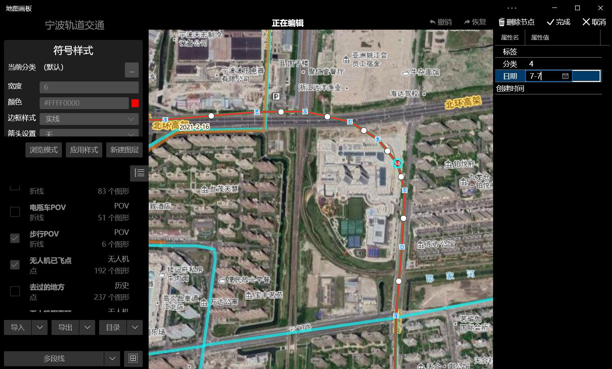
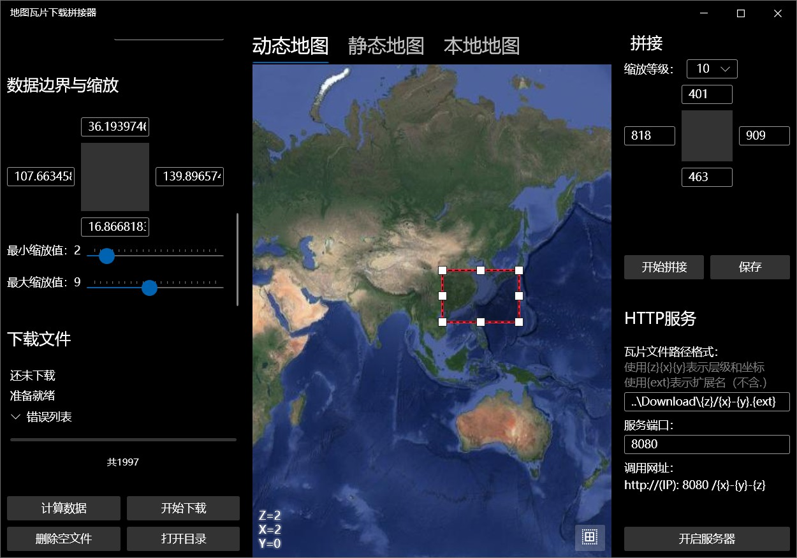

# 地图画板

## 简介

《地图画板》是一个以地图为底图的矢量画板软件，支持图层管理、分类上色、标签显示、简单分析、快速编辑等功能，上手简单、运行速度快。同时，配有《瓦片地图下载器》和《GPX工具箱》两个辅助软件，可以用于缓存离线地图、处理GPX文件。

## 结构

| 项目名称 | 介绍                                                  |
| -------- | ----------------------------------------------------- |
| Model    | 包含一些基础的模型/数据类                             |
| Core     | 包含一些地理和地图的工具类、输入输出类、图层管理      |
| UI       | 以WPF为技术的桌面端GUI程序                            |
| MAUI     | 以MAUI为技术的跨平台多端轻量版程序（暂仅支持Android） |

## 截图

### 桌面版

主界面

选择界面

编辑界面

GPX工具箱

地图瓦片下载拼接器

### 手机版

## 注意事项

- 执行 `.build.ps1`能够一键构建，位于 `Generation\Publish`中。
- `MapBoard.Package`项目用于生成MSIX安装包或者提交到Windows应用商店中。
- 屎山
	- 由于开发时间早，当时本人能力有限，代码写得很烂：
	- 设计模式约等于无，结构糟糕，静态变量盛行，Code Behind和MVVM混杂，维护极其困难。
	- 即使是2023年开发的MAUI版本，为了适应电脑版的代码风格，也没有采用完全体的MVVM。
	- 由于软件已过于庞大，我已无力进行如此规模的重构。
	- 2024年起，我已拥抱Avalonia跨平台开发，而本软件使用的地图框架ArcGIS Maps SDK不支持也不太可能在后续支持非微软官方出品的Avalonia。
	- 因此，现在该软件处于摆烂的状态，根据实际需要，在屎山上稍微改改，已无大改的可能。